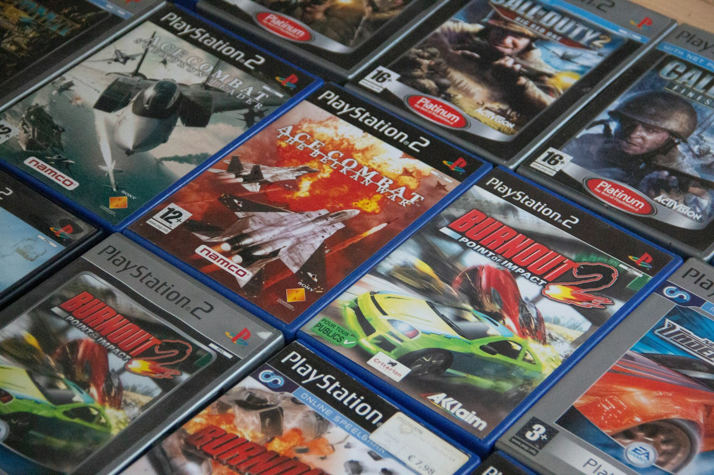
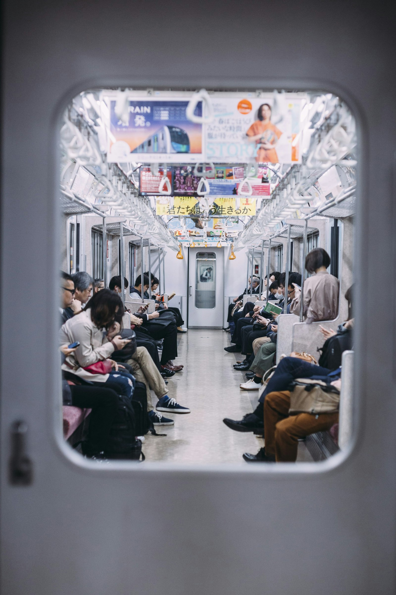

I noticed it first with a food delivery app. Two years ago I opened it, tapped a restaurant, tapped an order, done. Last week the same app made me dismiss a full-screen promo, decline a subscription, scroll past four "sponsored" restaurants that were not what I searched for, and then quoted me a service fee, a delivery fee, and a "small order fee" - on an order that was not small.

Nothing broke. Nobody shipped a bug. The app is doing exactly what it was rebuilt to do.

Cory Doctorow gave this a name: **enshittification**. The shape of it is always the same.

## The three acts

**Act one: they are good to users.** The product is cheap or free, ad-free, generous. Search returns what you searched for. The feed shows people you follow. Rides are suspiciously affordable. This part is funded by investors, not by the business making sense, and it exists to buy your habits.

**Act two: they are good to business customers.** Once leaving is inconvenient - your friends are there, your playlists are there, your reviews are there, your entire order history is there - the value gets moved. Sellers get reach, advertisers get placement, publishers get traffic. Users start paying with attention instead of money.

**Act three: they claw the value back for themselves.** Now that both sides are locked in, the platform takes it all. Ads get denser. Reach you were promised gets sold back to you as "boost". Fees appear that were never there. Features you used become the paid tier. The thing you actually came for gets pushed further and further below the fold.

You are not imagining the decline. You are watching a value transfer happen in slow motion, in the UI.

## Why it does not stop

The obvious question is: why does anyone tolerate it? The honest answer is that leaving costs more than staying, and the platforms know precisely what that cost is.

Switching costs are the whole game. Your data is portable in theory and hostile to export in practice. Your social graph does not come with you. Your subscriptions renew silently. Your smart home stops being smart if you change ecosystems. Every one of those is a deliberate design decision, not an accident of engineering.

And competition, the thing that is supposed to punish this, mostly is not there anymore. The alternative got acquired. The other alternative got funded by the same people. Interoperability - the thing that once let you leave a service and keep talking to the people still on it - got API'd out of existence a decade ago.

So the decline has no brake. A worse product does not lose customers fast enough to matter, and the quarterly numbers go up. From the inside, that reads as success.

## It did not used to be this aggressive

Corporations were never charities. Ten or twenty years ago they wanted your money just as badly - but the techniques had limits. An ad was a banner you ignored. A subscription was something you signed up for on purpose, and cancelling was a button. Software you bought stayed bought; it did not phone home, did not re-negotiate its terms with you every quarter, did not decide one morning that the feature you paid for is now an add-on. There was a floor under how much a company would degrade the thing you were using, because degrading it too far felt shameful and because someone across the street would happily take you in.

That floor is gone. What replaced it is optimisation - continuous, automated, personalised optimisation of exactly how much friction you will tolerate before you walk. And it is not confined to apps. Writing this in 2026, it genuinely feels like the world gets a little less liveable every year. Groceries, rent, a place to sleep that is not a financial event - the basics are the part that got hard. Every day carries a low hum of just staying afloat. The same logic that turned a food app into a fee-extraction funnel is running on housing and on the shelf price of food, and there is no export button for either of those.

## The game used to just be the game

The clearest version of this, for me, is games.

You bought a game. You brought home a box, put the disc in the PS2 or the Xbox, and played it. When you were done it went on the shelf. That was the entire transaction. No season pass, no expansion you needed to keep up, no cosmetics, no currency that comes in bundles of 1100 so you can never spend it evenly, no battle pass with a timer on it. The thing you bought was the thing. Life was simpler and somehow all of it worked.

I played Call of Duty recently - Black Ops 6, I think, the sixth one at this point - a series that used to be my favourite alongside MW3. And the game underneath is still competent, that is not the complaint. The complaint is what it is *about* now. The main visible aspiration is that your gun shimmers in rainbow colours and you sprint around the map dressed as a grim reaper. Not the maps, not the movement, not the campaign. The thing being sold is the cosmetics, and the game is what surrounds the store.

That was not a technical evolution. It is the three acts again, on a disc I used to own.

## Escaping backwards

Maybe this is why so much of what I build points backwards.

Apologies in advance for the shameless plug - it is the only example I have that I actually built. [Vanture Club](https://vanture.club/) is an internet radio dressed as a vintage pastel desktop - draggable windows, pixel fonts, striped title bars in faded pink and teal, a guestbook, a TV channel, and music that insists it is permanently the summer of 1986. There is no feed. Nothing is optimised for retention. Nobody is being funneled anywhere. It is a place, and the only thing it wants from you is that you hang around.

I know the nostalgia is partly a lie. The era it borrows from had its own corporations and its own quiet cruelties, and I am remembering the aesthetic, not the reality. But building it is the only way I have found to make the thing I miss - software that was simply *for* something, with an end to it - and to sit inside that for a while instead of just complaining that it is gone.

## The apathy

Because the honest summary is that living is more of a chore now than it has ever been in my lifetime.

A decent life without permanently chasing money is getting harder to reach. Freedom, as it is currently offered, looks like a nine-to-five - which in practice is eight to ten hours a day, every day, with two days off a week to recover enough to do it again. The cost of keeping a roof over your head climbs faster than anything meant to cover it. Everything that used to be a purchase is a subscription now: your music, your films, your tools, your car's heated seats. You own almost nothing you used to own, you rent it, and the rent goes up whenever they feel like it. And the thing that soaks up whatever is left of your attention is a feed - because who *isn't* scrolling TikTok every day, myself very much included.

Every one of those is a small tax on being a person, and they compound. Put them together and you get the mood I see in more or less everyone I talk to: not anger, not protest, just apathy. A quiet agreement that this is how it is and there is no point pushing at it. That is the part that worries me most - not any single fee or shut-down feature, but how thoroughly people have stopped expecting better.

So I will end with the question I actually have, rather than pretending I have an answer.

Is there a way back up? Are these things fixable - the platforms, the prices, the slow grind of everything getting a bit worse and a bit more expensive - or are we locked into conditions that decline a little every year, on a planet where the floor keeps dropping?

I genuinely do not know. I would like to be wrong about the pessimistic answer.

---

*Photos by Siri Louis, Denise Jans and Liam Burnett-Blue on [Unsplash](https://unsplash.com/).*
